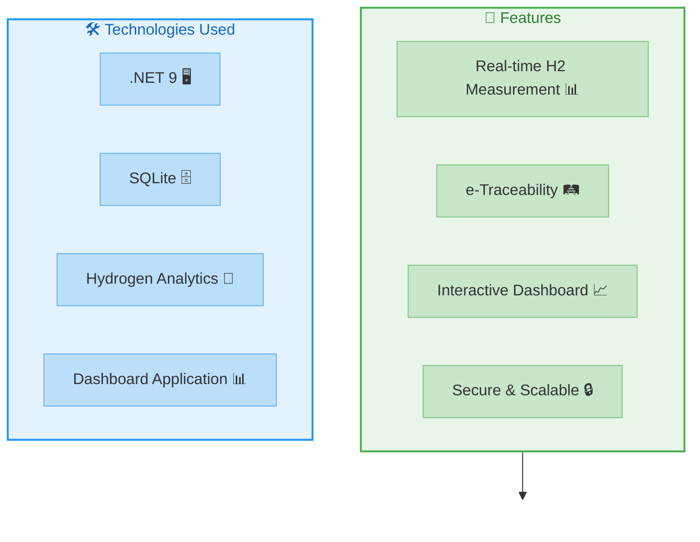

# H2 In-Situ Measurement & e-Traceability Platform 🚀  

   

  

## 📌 About  

Welcome to the **H2 Measurement & e-Traceability Platform**! 🌱  
This platform is designed to revolutionize the way we measure, track, and manage hydrogen (H2). Built with .NET technologies, it ensures transparency, accuracy, and efficiency in hydrogen-related operations.  


🔗 Visit us at: [loghid.com](https://loghid.com)  





## 📦 Installation  

1. Clone the repository:  

   ```bash
   git clone https://github.com/rubenvmu/loghid.git
   ```

2. Navigate to the project directory:  

   ```bash
   cd loghid
   ```

3. Install dependencies:  

   ```bash
   dotnet restore
   ```

4. Run the application:  

   ```bash
   dotnet run
   ```

---


## 📊 Loghid ISO Parameters Diagram


---

## 📊 Loghid eMovilab Diagram

```mermaid
classDiagram
    direction BT
    
    class IeSprinterLab {
        <<interface>>
        +int Id
        +string Vehicle
        +double VehiclePrice
        +double CargoCapacity
        +double InteriorSpace
        +double AutonomyCapacity
        +double PricePer100km
        +double Chromatograph
        +double TCD
        +double FID
        +double Hygrometer
        +double FPD
        +double PressureRegulators
        +double StandardGasBottles
        +double GasColumns
        +double HeliumCarrierGas
        +double AirFuelGas
        +double ChromatographCertification
        +double RegulatoryConsultations
        +double AnalysisService
        +double Calibration
        +double VehicleMaintenance
        +double TotalPrice()* Calculated
    }

    class eSprinterLab {
        <<Entity>>
        +int Id
        +string Vehicle
        +double VehiclePrice
        +double CargoCapacity
        +double InteriorSpace
        +double AutonomyCapacity
        +double PricePer100km
        +double Chromatograph
        +double TCD
        +double FID
        +double Hygrometer
        +double FPD
        +double PressureRegulators
        +double StandardGasBottles
        +double GasColumns
        +double HeliumCarrierGas
        +double AirFuelGas
        +double ChromatographCertification
        +double RegulatoryConsultations
        +double AnalysisService
        +double Calibration
        +double VehicleMaintenance
        +double TotalPrice() Calculated
        
        note for eSprinterLab "Annotations:
        - [Key] (Primary Key)
        - [DatabaseGenerated]
        - [Required]
        - [MaxLength(100)]
        - [Range] validations
        - Default values set"
    }

    IeSprinterLab <|.. eSprinterLab
   ```

---

## 📜 License  

This project is licensed under the **MIT License**.  

---

## 📞 Contact  

For inquiries, collaborations, or support, reach out to us:  
📧 Email: [rvmu@araintel.com](mailto:rvmu@araintel.com)  

---

---
