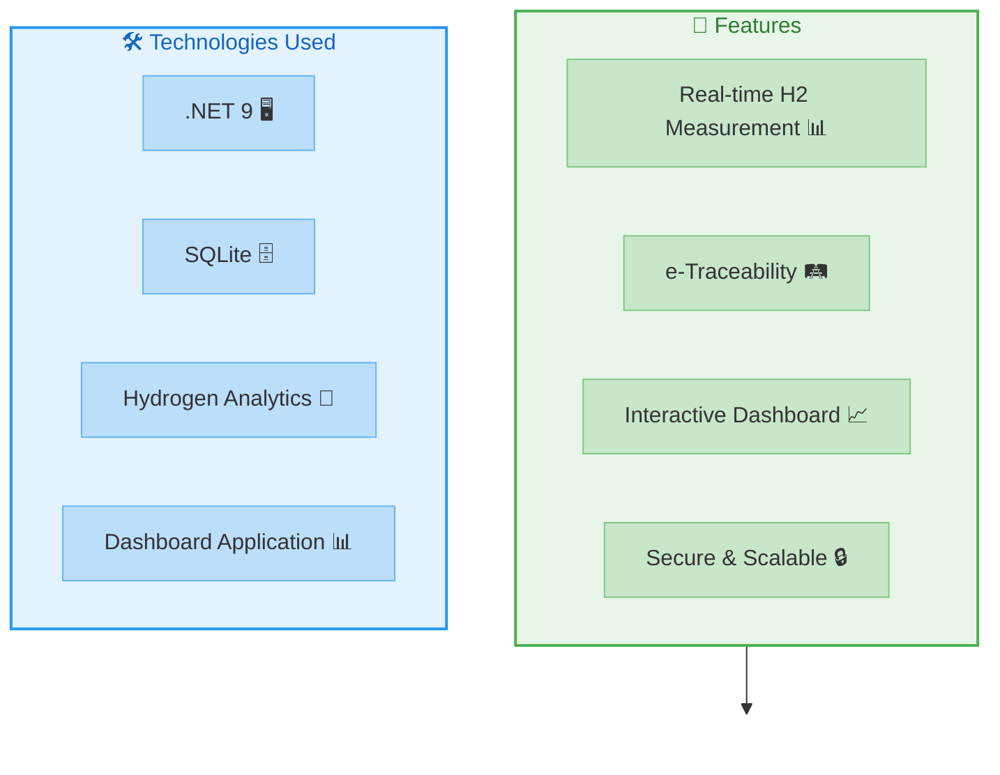
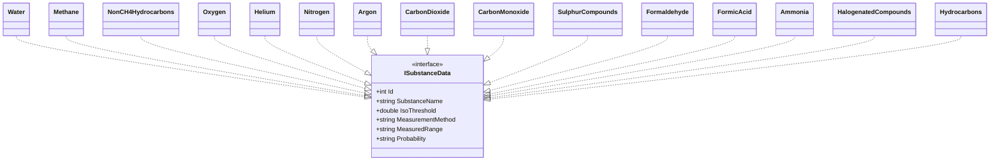
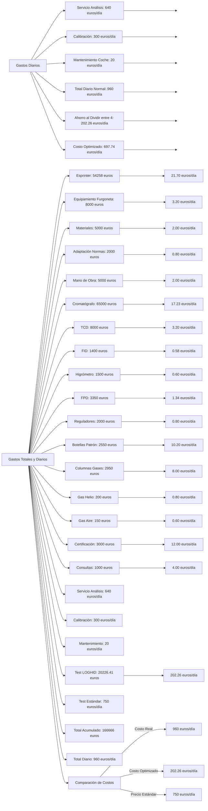
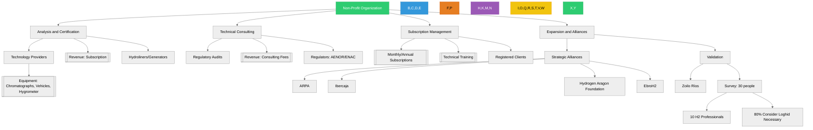
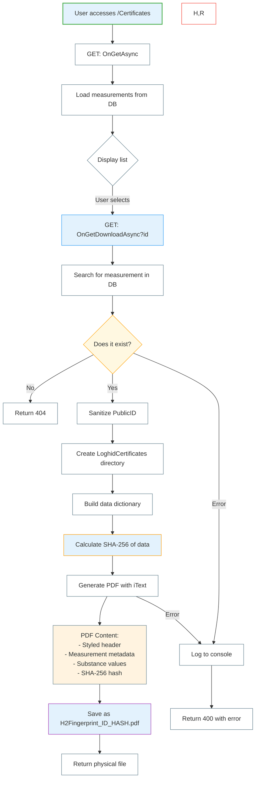
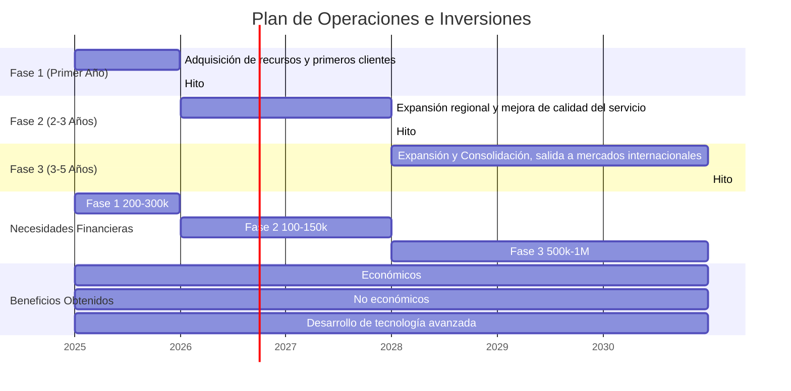

```mermaid
%%{init: {'theme': 'neutral', 'themeVariables': { 'primaryColor': '#ffffff', 'edgeLabelBackground':'#fff', 'tertiaryColor': '#fff0f0'}}}%%
graph TB
    A[LOGHID Setup Costs] --> B[One-Time Costs]
    A --> C[Annual Costs]
    A --> D[Total 1st Year Investment]
    
    %% One-Time Costs
    B --> E[Association Registration: €150]
    B --> F[Notary: €80-120]
    B --> G[Registration: €50-100]
    B --> H[Legal Advisory: €400-600]
    B --> I[Bank Account: €0-100]
    B --> J[Trademark Registration: €150]
    B --> K[Other Costs: €200-400]
    
    %% Annual Costs
    C --> L[Liability Insurance: €250-400]
    C --> M[Accounting: €600-1200]
    C --> N[Web/Hosting: €100-200]
    C --> O[Domain: €100-200]
    
    %% Totals
    D --> P[Setup Total: €780-1220]
    D --> Q[Operation Total: €1150-2200]
    D --> R[Total Investment: €1930-3420]
    
    %% Validation
    A --> S[Validation & Support]
    S --> T[Zoilo Ríos]
    S --> U[30 People Survey]
    U --> V[86% Satisfaction]
    
    style A fill:#2ecc71,stroke:#27ae60,color:#fff
    style B,C fill:#3498db,stroke:#2980b9,color:#fff
    style E,F,G,H,I,J,K,L,M,N,O fill:#e67e22,stroke:#d35400
    style P,Q,R fill:#9b59b6,stroke:#8e44ad,color:#fff
    style S,T,U,V fill:#f1c40f,stroke:#f39c12
```

# H2 In-Situ Measurement & e-Traceability Platform 🚀  

   

  

## 📌 About  

Welcome to the **H2 Measurement & e-Traceability Platform**! 🌱  
This platform is designed to revolutionize the way we measure, track, and manage hydrogen (H2). Built with .NET technologies, it ensures transparency, accuracy, and efficiency in hydrogen-related operations.  


🔗 Visit us at: [loghid.com](https://loghid.com)  





## 📦 Installation  

1. Clone the repository:  

   ```bash
   git clone https://github.com/rubenvmu/loghid.git
   ```

2. Navigate to the project directory:  

   ```bash
   cd loghid
   ```

3. Install dependencies:  

   ```bash
   dotnet restore
   ```

4. Run the application:  

   ```bash
   dotnet run
   ```

---


## 📊 Loghid ISO Parameters Diagram



---

## 📊 Loghid eMovilab Diagram

```mermaid
classDiagram
    direction BT
    
    class IeSprinterLab {
        <<interface>>
        +int Id
        +string Vehicle
        +double VehiclePrice
        +double CargoCapacity
        +double InteriorSpace
        +double AutonomyCapacity
        +double PricePer100km
        +double Chromatograph
        +double TCD
        +double FID
        +double Hygrometer
        +double FPD
        +double PressureRegulators
        +double StandardGasBottles
        +double GasColumns
        +double HeliumCarrierGas
        +double AirFuelGas
        +double ChromatographCertification
        +double RegulatoryConsultations
        +double AnalysisService
        +double Calibration
        +double VehicleMaintenance
        +double TotalPrice()* Calculated
    }

    class eSprinterLab {
        <<Entity>>
        +int Id
        +string Vehicle
        +double VehiclePrice
        +double CargoCapacity
        +double InteriorSpace
        +double AutonomyCapacity
        +double PricePer100km
        +double Chromatograph
        +double TCD
        +double FID
        +double Hygrometer
        +double FPD
        +double PressureRegulators
        +double StandardGasBottles
        +double GasColumns
        +double HeliumCarrierGas
        +double AirFuelGas
        +double ChromatographCertification
        +double RegulatoryConsultations
        +double AnalysisService
        +double Calibration
        +double VehicleMaintenance
        +double TotalPrice() Calculated
        
        note for eSprinterLab "Annotations:
        - [Key] (Primary Key)
        - [DatabaseGenerated]
        - [Required]
        - [MaxLength(100)]
        - [Range] validations
        - Default values set"
    }

    IeSprinterLab <|.. eSprinterLab
   ```

---

## 📊 Competitors

```mermaid
flowchart TD
    subgraph Competitors
        direction LR
        subgraph C1["LOGHID"]
            C1_1[Applied ISO Standard: RFNBO, ISO 14687, ISO 19880-8]
            C1_2[Real-Time Measurement: Yes]
            C1_3[Digital Traceability: H2 Footprint]
            C1_4[User Interface: Intuitive]
            C1_5[Infrastructure Requirement: Very Low]
            C1_6[Process Automation: Loghid Certificate]
            C1_7[Data Security and Protection: High - AES-256 Encryption]
            C1_8[EU Regulation Compliance: RFNBO]
            C1_9[Integration Ease: High - API REST]
            C1_10[Support and Updates: Continuous]
            C1_11[Mobility: National]
            C1_12[Open Source: Yes]
            C1_13[Business Model: Non-Profit]
        end

        subgraph C2["LHYFE + ATMEN"]
            C2_1[Applied ISO Standard: RFNBO, ISO 14687]
            C2_2[Real-Time Measurement: High]
            C2_3[Digital Traceability: Digital Passport]
            C2_4[User Interface: Medium]
            C2_5[Infrastructure Requirement: Medium]
            C2_6[Process Automation: RFNBO Automation]
            C2_7[Data Security and Protection: High]
            C2_8[EU Regulation Compliance: RFNBO]
            C2_9[Integration Ease: Medium - With Atmen]
            C2_10[Support and Updates: Regional]
            C2_11[Mobility: Commercial Company]
            C2_12[Open Source: No]
            C2_13[Business Model: Commercial Company]
        end
    end

    style C1 fill:#E8F5E9,stroke:#4CAF50,stroke-width:2px,color:#2E7D32
    style C2 fill:#E3F2FD,stroke:#2196F3,stroke-width:2px,color:#1565C0

    classDef default fill:#ffffff,stroke:#607D8B
    classDef c1Style fill:#C8E6C9,stroke:#81C784,stroke-width:1px
    classDef c2Style fill:#BBDEFB,stroke:#64B5F6,stroke-width:1px

    class C1_1,C1_2,C1_3,C1_4,C1_5,C1_6,C1_7,C1_8,C1_9,C1_10,C1_11,C1_12,C1_13 c1Style
    class C2_1,C2_2,C2_3,C2_4,C2_5,C2_6,C2_7,C2_8,C2_9,C2_10,C2_11,C2_12,C2_13 c2Style
```

## 📊 Loghid First Year Investment Flowchart

---



---

## 📊 Loghid Service Cost Flowchart


---

## 📊 Loghid Organizational Flowchart



---

## 📊 Loghid H2 Fingerprint - SHA256 Hash



## 📊 Operative plan


---

## 📜 License  

This project is licensed under the **MIT License**.  

---

## 📞 Contact  

For inquiries, collaborations, or support, reach out to us:  
📧 Email: [info@loghid.com](mailto:info@loghid.com)  
🌐 Website: [loghid.com](https://loghid.com)  

---

---
