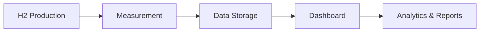

# European H2 Measurement & e-Traceability Platform 🚀  

  

## 📌 About  

Welcome to the **European H2 Measurement & e-Traceability Platform**! 🌱  
This platform is designed to revolutionize the way we measure, track, and manage hydrogen (H2) data across Europe. Built with cutting-edge technology, it ensures transparency, accuracy, and efficiency in hydrogen-related operations.  

🔗 Visit us at: [loghid.com](https://loghid.com)  

---

## 🚀 Features  

- **Real-time H2 Measurement** 📊  
- **e-Traceability** 🛤️  
- **Interactive Dashboard** 📈  
- **Data Analytics** 🔍  
- **Secure & Scalable** 🔒  

---

## 🛠️ Technologies Used  

- **.NET** 🖥️  
- **SQLite** 🗄️  
- **Hydrogen Analytics** 🌿  
- **Dashboard Application** 📊  

---

## 📦 Installation  

1. Clone the repository:  
   ```bash
   git clone https://github.com/rubenvmu/loghid.git
   ```
2. Navigate to the project directory:  
   ```bash
   cd loghid
   ```
3. Install dependencies:  
   ```bash
   dotnet restore
   ```
4. Run the application:  
   ```bash
   dotnet run
   ```

---

## 🌐 Usage  

1. Log in to the platform.  
2. Access the **Dashboard** for real-time H2 measurements.  
3. Use the **e-Traceability** feature to track hydrogen data.  
4. Generate reports and analytics for better decision-making.  

---

## 📊 Data Flow  



---

## 📜 License  

This project is licensed under the **MIT License**.  

---

## 📞 Contact  

For inquiries, collaborations, or support, reach out to us:  
📧 Email: [info@loghid.com](mailto:info@loghid.com)  
🌐 Website: [loghid.com](https://loghid.com)  

---

---

### Badges  

  
  
